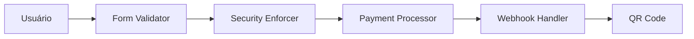
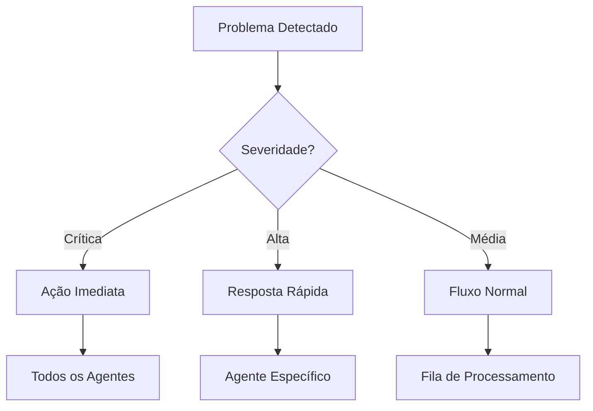

# GUIA DOS AGENTES CLAUDE

## VISÃO GERAL DO SISTEMA DE AGENTES

O sistema SOS Checkout Brinks utiliza uma arquitetura baseada em agentes especializados, cada um responsável por um domínio específico do sistema.

## AGENTES DISPONÍVEIS

### 1. Payment Processor Agent
**Prioridade:** Crítica  
**Arquivo:** `.claude/payment-processor.md`

**Responsabilidades:**
- Processar pagamentos via MercadoPago
- Gerenciar tokens de pagamento
- Implementar idempotência
- Tratar erros de pagamento

**Quando Usar:**
- Implementação de checkout
- Processamento de cartão/PIX
- Verificação de status de pagamento
- Implementação de refund

### 2. Form Validator Agent
**Prioridade:** Alta  
**Arquivo:** `.claude/form-validator.md`

**Responsabilidades:**
- Validar dados médicos
- Sanitizar entradas
- Prevenir XSS/SQL Injection
- Garantir conformidade LGPD

**Quando Usar:**
- Validação de formulários
- Sanitização de dados
- Implementação de regras de negócio
- Validação em tempo real

### 3. Webhook Handler Agent
**Prioridade:** Crítica  
**Arquivo:** `.claude/webhook-handler.md`

**Responsabilidades:**
- Processar webhooks MercadoPago
- Validar HMAC
- Gerenciar filas de eventos
- Gerar QR Codes

**Quando Usar:**
- Configuração de webhooks
- Processamento assíncrono
- Geração de QR Code
- Atualização de status

### 4. Security Enforcer Agent
**Prioridade:** Crítica  
**Arquivo:** `.claude/security-enforcer.md`

**Responsabilidades:**
- Implementar headers de segurança
- Rate limiting
- Detecção de fraude
- Auditoria e compliance

**Quando Usar:**
- Configuração de segurança
- Implementação de CSP
- Rate limiting
- Detecção de ataques

## COMO USAR OS AGENTES

### Invocação Individual

```bash
# Exemplo de comando para Claude
"Por favor, use o Payment Processor Agent para implementar o processamento de pagamento PIX"

"Consulte o Form Validator Agent para validar o campo CPF com as regras corretas"

"Use o Security Enforcer Agent para configurar os headers de segurança"
```

### Colaboração Entre Agentes



### Fluxo de Checkout Completo

1. **Form Validator** valida dados médicos
2. **Security Enforcer** verifica rate limiting
3. **Payment Processor** processa pagamento
4. **Webhook Handler** aguarda confirmação
5. **Webhook Handler** gera QR Code

## COMANDOS ESPECÍFICOS POR AGENTE

### Payment Processor Commands

```typescript
// Processar Pagamento
{
  agent: "payment-processor",
  command: "PROCESS_PAYMENT",
  data: PaymentData
}

// Verificar Status
{
  agent: "payment-processor",
  command: "VERIFY_STATUS",
  paymentId: string
}
```

### Form Validator Commands

```typescript
// Validar Campo
{
  agent: "form-validator",
  command: "VALIDATE_FIELD",
  field: string,
  value: any
}

// Sanitizar Dados
{
  agent: "form-validator",
  command: "SANITIZE_DATA",
  data: Record<string, any>
}
```

### Webhook Handler Commands

```typescript
// Processar Webhook
{
  agent: "webhook-handler",
  command: "PROCESS_WEBHOOK",
  payload: any,
  headers: Headers
}

// Gerar QR Code
{
  agent: "webhook-handler",
  command: "GENERATE_QR_CODE",
  profileId: string
}
```

### Security Enforcer Commands

```typescript
// Bloquear IP
{
  agent: "security-enforcer",
  command: "BLOCK_IP",
  ip: string,
  duration: number
}

// Ativar Proteção
{
  agent: "security-enforcer",
  command: "ENABLE_PROTECTION",
  type: string,
  level: string
}
```

## PRIORIDADES E ESCALAÇÃO

### Níveis de Prioridade

1. **Crítica** - Resposta imediata
   - Payment Processor
   - Webhook Handler
   - Security Enforcer

2. **Alta** - Resposta em minutos
   - Form Validator

3. **Média** - Resposta em horas
   - Otimizações
   - Melhorias

### Escalação de Problemas



## INTEGRAÇÃO COM CLAUDE

### Estrutura de Arquivos

```
.claude/
├── claude_config.json       # Configuração principal
├── payment-processor.md     # Agente de pagamento
├── form-validator.md        # Agente de validação
├── webhook-handler.md       # Agente de webhook
└── security-enforcer.md     # Agente de segurança
```

### Exemplo de Uso com Claude

```markdown
# Comando para Claude
"Preciso implementar a validação do formulário médico. 
Use o Form Validator Agent para criar as validações com Zod,
incluindo CPF, tipo sanguíneo e dados de emergência."

# Claude irá:
1. Consultar .claude/form-validator.md
2. Aplicar as regras definidas
3. Gerar código com validações corretas
4. Incluir sanitização e segurança
```

## WORKFLOWS AUTOMATIZADOS

### Workflow de Pagamento

```yaml
name: Payment Processing
agents:
  - form-validator
  - security-enforcer
  - payment-processor
  - webhook-handler

steps:
  1:
    agent: form-validator
    action: validate_medical_form
    
  2:
    agent: security-enforcer
    action: check_rate_limit
    
  3:
    agent: payment-processor
    action: process_payment
    
  4:
    agent: webhook-handler
    action: wait_confirmation
    
  5:
    agent: webhook-handler
    action: generate_qr_code
```

### Workflow de Segurança

```yaml
name: Security Check
agents:
  - security-enforcer
  - form-validator

steps:
  1:
    agent: security-enforcer
    action: validate_headers
    
  2:
    agent: security-enforcer
    action: check_device_fingerprint
    
  3:
    agent: form-validator
    action: detect_xss_attempts
    
  4:
    agent: security-enforcer
    action: log_security_event
```

## MONITORAMENTO DOS AGENTES

### Métricas por Agente

| Agente | Métrica Principal | Threshold | Ação se Exceder |
|--------|------------------|-----------|-----------------|
| Payment Processor | Taxa de Erro | 5% | Alerta Crítico |
| Form Validator | Validações Falhas | 20% | Revisar Regras |
| Webhook Handler | Tempo de Resposta | 30s | Scale Workers |
| Security Enforcer | Ataques Detectados | 10/min | Modo Emergência |

### Dashboard de Status

```typescript
const agentStatus = {
  'payment-processor': {
    status: 'HEALTHY',
    lastRun: '2024-01-15T10:30:00Z',
    successRate: 0.98,
    avgResponseTime: 1200
  },
  'form-validator': {
    status: 'HEALTHY',
    lastRun: '2024-01-15T10:31:00Z',
    validationRate: 0.85,
    commonErrors: ['CPF', 'Email']
  },
  'webhook-handler': {
    status: 'HEALTHY',
    queueSize: 12,
    processingRate: 50,
    lastWebhook: '2024-01-15T10:29:00Z'
  },
  'security-enforcer': {
    status: 'ALERT',
    threatsDetected: 3,
    blockedIPs: ['192.168.1.100'],
    protectionLevel: 'MEDIUM'
  }
}
```

## TROUBLESHOOTING

### Problemas Comuns

1. **Payment Processor não processa pagamento**
   - Verificar credenciais MercadoPago
   - Validar formato dos dados
   - Checar logs de erro

2. **Form Validator rejeita dados válidos**
   - Revisar regras de validação
   - Verificar sanitização excessiva
   - Ajustar mensagens de erro

3. **Webhook Handler não recebe eventos**
   - Validar URL no MercadoPago
   - Verificar HMAC secret
   - Checar firewall/CORS

4. **Security Enforcer bloqueia usuários legítimos**
   - Ajustar rate limiting
   - Revisar regras de detecção
   - Whitelist IPs confiáveis

## BOAS PRÁTICAS

### Ao Usar os Agentes

1. **Sempre especifique o agente correto**
2. **Use comandos padronizados**
3. **Monitore métricas continuamente**
4. **Documente mudanças**
5. **Teste em ambiente sandbox**

### Manutenção

1. **Revise logs semanalmente**
2. **Atualize regras mensalmente**
3. **Faça backup das configurações**
4. **Teste workflows regularmente**
5. **Mantenha documentação atualizada**

## REFERÊNCIAS RÁPIDAS

### Arquivos dos Agentes
- Payment: `.claude/payment-processor.md`
- Validation: `.claude/form-validator.md`
- Webhooks: `.claude/webhook-handler.md`
- Security: `.claude/security-enforcer.md`

### Configuração Principal
- Config: `.claude/claude_config.json`

### Documentação
- Implementação: `docs/01-implementation-plan.md`
- Arquitetura: `docs/02-architecture-ddd.md`
- MercadoPago: `docs/03-mercadopago-integration.md`
- Este guia: `docs/04-agents-guide.md`