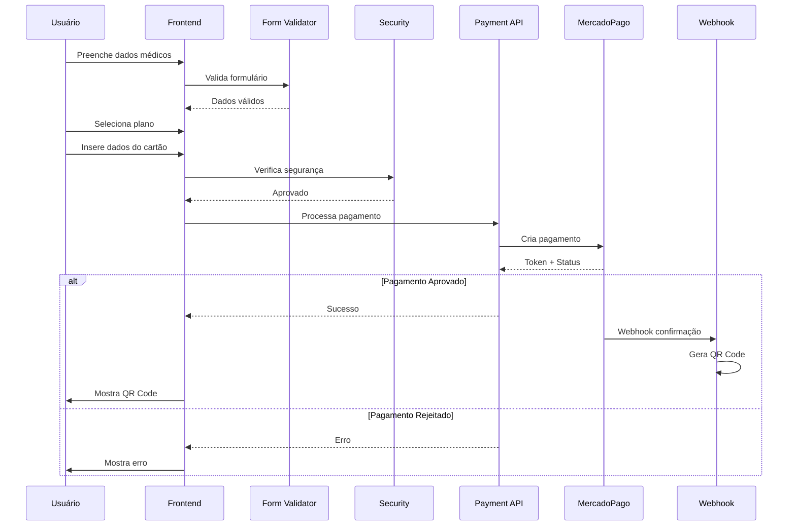
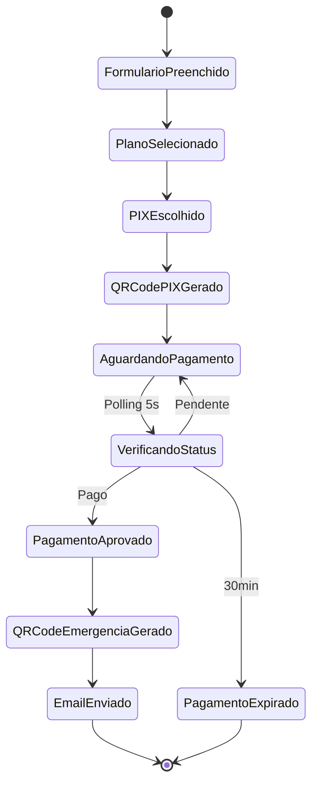
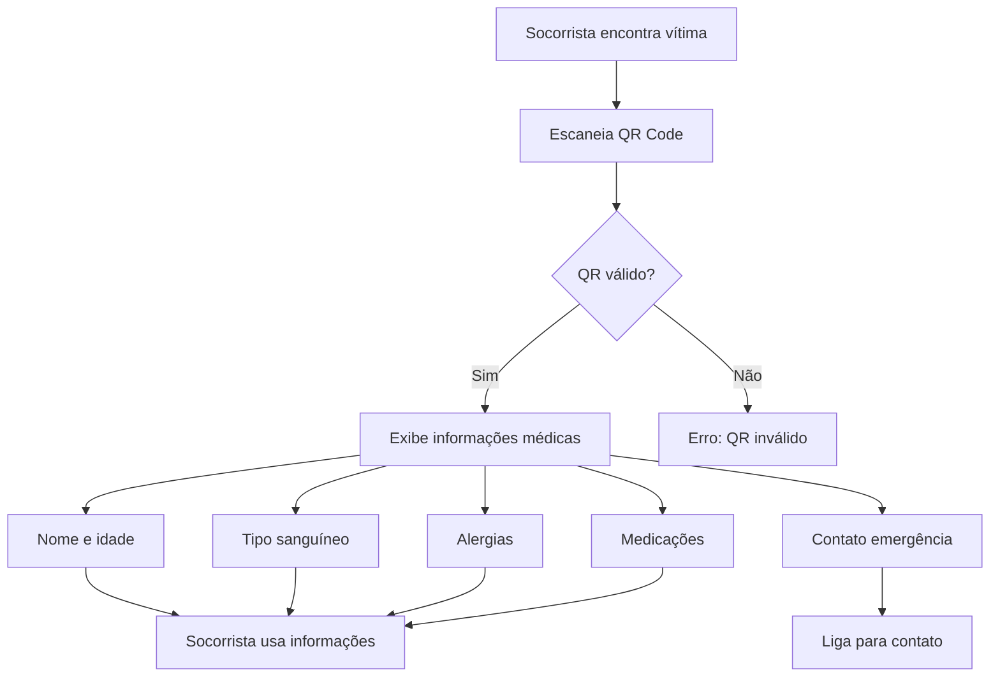
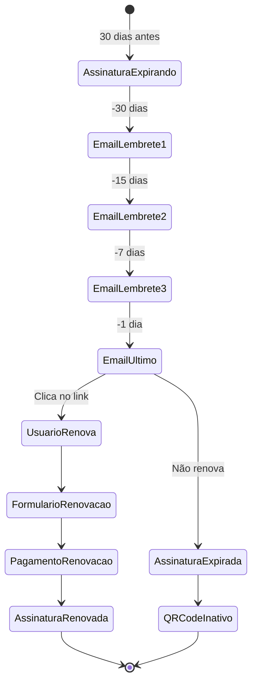

# CASOS DE USO E FLUXOS DETALHADOS

## UC001 - CHECKOUT COM CARTÃO DE CRÉDITO

### Atores
- Motociclista (Usuário Principal)
- Sistema SOS Brinks
- MercadoPago API
- Sistema de Email

### Pré-condições
- Usuário preencheu formulário médico
- Selecionou plano (Básico ou Premium)
- Tem cartão de crédito válido

### Fluxo Principal



### Fluxo Alternativo - Parcelamento

1. Após inserir dados do cartão
2. Sistema detecta cartão de crédito
3. Exibe opções de parcelamento (1-12x)
4. Usuário seleciona parcelas
5. Sistema calcula juros (se aplicável)
6. Continua fluxo principal

### Pós-condições de Sucesso
- Pagamento aprovado
- QR Code gerado
- Email enviado
- Dados salvos no Firebase

### Tratamento de Erros

| Erro | Ação | Mensagem ao Usuário |
|------|------|-------------------|
| Token expirado | Regenerar token | "Sessão expirada, tente novamente" |
| Cartão inválido | Solicitar novo cartão | "Verifique os dados do cartão" |
| Saldo insuficiente | Sugerir outro método | "Saldo insuficiente, tente outro cartão" |
| Limite excedido | Sugerir parcelamento | "Tente parcelar ou use outro cartão" |

---

## UC002 - CHECKOUT COM PIX

### Atores
- Motociclista
- Sistema SOS Brinks
- MercadoPago API
- App Bancário do Usuário

### Pré-condições
- Formulário médico preenchido
- Plano selecionado
- Acesso a app bancário com PIX

### Fluxo Principal



### Detalhamento do Fluxo

1. **Geração do PIX**
   ```typescript
   // Payment Processor gera PIX
   const pixPayment = {
     amount: selectedPlan.price,
     payerEmail: formData.email,
     description: 'QR Code Emergência Médica'
   }
   ```

2. **Exibição do QR Code PIX**
   - QR Code em base64
   - Código copia-e-cola
   - Timer de 30 minutos
   - Instruções passo-a-passo

3. **Polling de Status**
   ```typescript
   // Verificação a cada 5 segundos
   const checkStatus = setInterval(async () => {
     const status = await verifyPayment(paymentId);
     if (status === 'approved') {
       clearInterval(checkStatus);
       generateEmergencyQRCode();
     }
   }, 5000);
   ```

### Pós-condições
- PIX pago e confirmado
- QR Code de emergência gerado
- Perfil médico ativo

---

## UC003 - LEITURA DO QR CODE EMERGÊNCIA

### Atores
- Socorrista/Médico
- Sistema SOS Brinks
- Firebase Database

### Pré-condições
- QR Code válido e não expirado
- Acesso a leitor de QR Code

### Fluxo Principal



### Informações Exibidas

```typescript
interface EmergencyInfo {
  // Identificação
  fullName: string;
  age: number;
  bloodType: BloodType;
  
  // Médico
  allergies?: string[];
  medications?: string[];
  medicalConditions?: string[];
  
  // Contato
  emergencyContact: {
    name: string;
    phone: string;
    relationship: string;
  };
  
  // Meta
  lastUpdated: Date;
  planType: 'basic' | 'premium';
}
```

### Segurança da Leitura
- Dados criptografados no QR
- Acesso anônimo (sem login)
- Registro de acesso para auditoria
- Sem dados financeiros expostos

---

## UC004 - ATUALIZAÇÃO DE DADOS MÉDICOS

### Atores
- Motociclista
- Sistema SOS Brinks

### Pré-condições
- Assinatura ativa
- QR Code já gerado

### Fluxo Principal

1. Usuário acessa link do QR Code
2. Sistema identifica perfil
3. Exibe formulário com dados atuais
4. Usuário modifica informações
5. Sistema valida mudanças
6. Atualiza banco de dados
7. QR Code mantém mesma URL
8. Envia confirmação por email

### Validações na Atualização

```typescript
const updateValidation = {
  // Não pode mudar
  cpf: 'readonly',
  paymentId: 'readonly',
  
  // Pode mudar com validação
  bloodType: 'validate',
  allergies: 'sanitize',
  medications: 'sanitize',
  emergencyContact: 'validate',
  
  // Requer novo pagamento
  planType: 'new_payment_required'
}
```

---

## UC005 - RENOVAÇÃO DE ASSINATURA

### Atores
- Motociclista
- Sistema SOS Brinks
- MercadoPago

### Pré-condições
- Assinatura próxima do vencimento (30 dias)
- Email de notificação enviado

### Fluxo Principal



### Benefícios da Renovação
- Mantém mesmo QR Code
- Histórico preservado
- Desconto de fidelidade (10%)
- Processo simplificado

---

## UC006 - GESTÃO DE WEBHOOKS

### Atores
- MercadoPago
- Webhook Handler
- Sistema SOS Brinks

### Pré-condições
- Webhook configurado no MP
- HMAC secret configurado
- Endpoint disponível

### Fluxo de Processamento

```typescript
async function webhookFlow(request: Request) {
  // 1. Validação HMAC
  if (!validateHMAC(request)) {
    logSecurityEvent('HMAC_FAILED');
    return { status: 401 };
  }
  
  // 2. Parse do evento
  const event = parseWebhookEvent(request.body);
  
  // 3. Prevenir replay
  if (isReplayAttack(event)) {
    return { status: 200 }; // Silently ignore
  }
  
  // 4. Enfileirar para processamento
  await queue.add('webhook', event);
  
  // 5. Retornar imediatamente
  return { status: 200 };
  
  // 6. Processamento assíncrono
  queue.process('webhook', async (job) => {
    const { type, data } = job.data;
    
    switch(type) {
      case 'payment.approved':
        await handlePaymentApproved(data);
        break;
      case 'payment.rejected':
        await handlePaymentRejected(data);
        break;
      case 'payment.refunded':
        await handleRefund(data);
        break;
    }
  });
}
```

### Eventos Processados

| Evento | Ação | Prioridade |
|--------|------|-----------|
| payment.approved | Gerar QR Code | Alta |
| payment.pending | Aguardar | Média |
| payment.rejected | Notificar usuário | Alta |
| payment.refunded | Revogar QR Code | Crítica |
| chargeback | Investigar | Crítica |

---

## UC007 - SUPORTE E ATENDIMENTO

### Atores
- Motociclista
- Equipe de Suporte
- Sistema de Tickets

### Cenários de Suporte

1. **Pagamento não processado**
   - Verificar logs de pagamento
   - Checar status no MercadoPago
   - Reprocessar se necessário
   - Gerar QR manualmente se aprovado

2. **QR Code não funciona**
   - Validar expiração
   - Verificar criptografia
   - Regenerar se necessário
   - Enviar novo por email

3. **Dados incorretos**
   - Permitir edição supervisionada
   - Validar mudanças
   - Atualizar QR Code
   - Confirmar por email

### SLA de Atendimento
- Crítico: 1 hora
- Alto: 4 horas
- Médio: 24 horas
- Baixo: 48 horas

---

## UC008 - MONITORAMENTO E ALERTAS

### Sistema de Monitoramento

```typescript
const monitors = {
  // Disponibilidade
  uptime: {
    check: 'https://api.memoryys.com/health',
    interval: 60, // segundos
    alert: 'downtime > 5min'
  },
  
  // Performance
  responseTime: {
    threshold: 2000, // ms
    alert: 'p95 > threshold'
  },
  
  // Negócio
  paymentSuccess: {
    threshold: 0.95, // 95%
    window: 3600, // 1 hora
    alert: 'rate < threshold'
  },
  
  // Segurança
  securityEvents: {
    threshold: 10,
    window: 300, // 5 min
    alert: 'count > threshold'
  }
}
```

### Dashboard de Métricas

| Métrica | Verde | Amarelo | Vermelho |
|---------|-------|---------|----------|
| Uptime | > 99.9% | > 99% | < 99% |
| Response Time | < 1s | < 2s | > 2s |
| Payment Success | > 95% | > 90% | < 90% |
| Error Rate | < 1% | < 5% | > 5% |

---

## MATRIZ DE RASTREABILIDADE

| Requisito | UC001 | UC002 | UC003 | UC004 | UC005 | UC006 | UC007 | UC008 |
|-----------|-------|-------|-------|-------|-------|-------|-------|-------|
| Checkout Cartão | ✅ | | | | | ✅ | | |
| Checkout PIX | | ✅ | | | | ✅ | | |
| QR Code Emergência | ✅ | ✅ | ✅ | | | | | |
| Dados Médicos | ✅ | ✅ | ✅ | ✅ | | | | |
| Webhooks | ✅ | ✅ | | | ✅ | ✅ | | |
| Segurança | ✅ | ✅ | ✅ | ✅ | ✅ | ✅ | | ✅ |
| Renovação | | | | | ✅ | | | |
| Suporte | | | | | | | ✅ | |
| Monitoramento | | | | | | | | ✅ |

---

## CONCLUSÃO

Estes casos de uso cobrem todos os cenários principais do sistema SOS Checkout Brinks, garantindo:
- Processamento seguro de pagamentos
- Acesso rápido a informações de emergência
- Manutenção e renovação simplificadas
- Suporte eficiente
- Monitoramento contínuo

Cada fluxo foi desenhado para maximizar a conversão, minimizar erros e proporcionar a melhor experiência possível para motociclistas e socorristas.