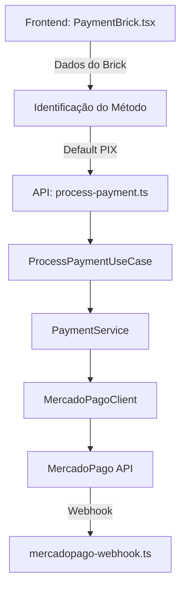

# 🔍 ANÁLISE COMPLETA DO SISTEMA - SOS CHECKOUT BRINKS

**Data: 31/08/2025**  
**Status: ⚠️ CRÍTICO - Múltiplos Problemas Identificados**

## 📋 SUMÁRIO EXECUTIVO

### Problemas Críticos Identificados:

1. **🔴 BUG CRÍTICO**: Pagamentos com cartão estão sendo processados como PIX
2. **🔴 UI INCORRETA**: Opções de pagamento não suportadas ainda aparecem (Débito Virtual CAIXA, Boleto)
3. **🟡 DUPLICIDADE**: Configuração de métodos de pagamento em múltiplos locais
4. **🟡 INCONSISTÊNCIA**: Suporte para boleto presente no código mas não implementado

## 🏗️ ARQUITETURA ATUAL DO SISTEMA

### 1. ESTRUTURA DE DIRETÓRIOS

```
sos-checkout-brinks/
├── api/                    # Vercel Functions (Serverless)
│   ├── _utils/            # Utilidades compartilhadas das APIs
│   ├── process-payment.ts # Processa pagamentos
│   ├── payment-status.ts  # Consulta status
│   ├── mercadopago-webhook.ts # Recebe webhooks
│   └── create-profile.ts  # Cria perfis médicos
├── lib/                   # Core Business Logic (DDD)
│   ├── application/       # Casos de uso
│   ├── domain/           # Entidades e regras de negócio
│   └── infrastructure/   # Implementações (Firebase, MercadoPago)
├── src/                   # Frontend React
│   ├── components/       # Componentes React
│   ├── hooks/           # Custom hooks
│   ├── pages/           # Páginas da aplicação
│   └── schemas/         # Validação de dados
└── erros/               # Logs e análises
```

### 2. FLUXO DE PAGAMENTO ATUAL



## 🐛 PROBLEMAS IDENTIFICADOS

### 1. BUG CRÍTICO: Cartão → PIX

**Localização**: `src/components/payment/PaymentBrick.tsx` (linhas 191-218)

```typescript
// PROBLEMA IDENTIFICADO
let paymentMethodId =
  brickData.payment_method_id ||
  brickData.paymentMethodId ||
  brickData.payment_method ||
  brickData.selectedPaymentMethod?.id ||
  brickData.formData?.payment_method_id ||
  brickData.formData?.payment_method;

// PIX vem como 'pix' ou sem token
const isPix =
  paymentMethodId === "pix" || (!paymentMethodId && !brickData.token);

if (isPix) {
  paymentMethod = "pix";
  paymentMethodId = "pix";
} else if (brickData.token) {
  // Tem token = cartão
  if (
    paymentMethodId &&
    (paymentMethodId.includes("debit") || paymentMethodId.includes("debito"))
  ) {
    paymentMethod = "debit_card";
  } else {
    paymentMethod = "credit_card";
  }
} else {
  // 🔴 PROBLEMA: Default para PIX se não identificado
  paymentMethod = "pix";
  paymentMethodId = "pix";
}
```

**Impacto**: Quando o método de pagamento não é identificado corretamente (que está acontecendo com cartões), o sistema defaulta para PIX, causando falha no processo.

### 2. OPÇÕES DE PAGAMENTO INCORRETAS NO UI

**Localização**: `src/hooks/usePayment.ts` (linhas 186-189)

```typescript
// PROBLEMA: Configuração permite todos os métodos
customization: {
  paymentMethods: {
    creditCard: 'all',
    debitCard: 'all',
    ticket: 'all',        // 🔴 Boleto habilitado mas não suportado
    bankTransfer: 'all',  // PIX
  },
```

**Mas em**: `src/components/payment/PaymentBrick.tsx` (linhas 148-152)

```typescript
// Configuração conflitante
paymentMethods: {
  creditCard: 'all',
  debitCard: 'all',
  bankTransfer: 'all',  // PIX
  ticket: 'none',       // 🟡 Boleto desabilitado aqui
  mercadoPago: 'none',
},
```

### 3. SUPORTE PARA BOLETO NÃO IMPLEMENTADO

Múltiplas referências a boleto em todo o sistema:

- `lib/application/dto/PaymentDTO.ts` - Aceita 'boleto' como método válido
- `lib/domain/entities/Payment.ts` - Tem lógica para boleto
- `lib/infrastructure/mercadopago/MercadoPagoClient.ts` - Processa boleto
- **MAS**: Frontend não tem UI para boleto

## 📁 MAPEAMENTO DE ARQUIVOS

### ARQUIVOS CRÍTICOS DO CHECKOUT

#### Frontend (src/)

- ✅ `src/components/payment/PaymentBrick.tsx` - **PROBLEMA PRINCIPAL AQUI**
- ✅ `src/components/payment/StatusScreenBrick.tsx` - Status do pagamento
- ✅ `src/components/payment/PixQRCode.tsx` - Exibição QR Code
- ✅ `src/hooks/usePayment.ts` - **CONFIGURAÇÃO DUPLICADA**
- ✅ `src/pages/CheckoutPage.tsx` - Página de checkout
- ✅ `src/pages/MedicalFormPage.tsx` - Formulário médico

#### Backend (api/)

- ✅ `api/process-payment.ts` - Processa pagamentos
- ✅ `api/payment-status.ts` - Consulta status
- ✅ `api/mercadopago-webhook.ts` - Webhook do MercadoPago
- ✅ `api/create-profile.ts` - Cria perfis
- ⚠️ `api/generate-qr.ts` - Gera QR Code (pode estar obsoleto)
- ⚠️ `api/get-profile.ts` - Busca perfil (fluxo antigo?)

#### Lógica de Negócio (lib/)

- ✅ `lib/application/use-cases/ProcessPaymentUseCase.ts` - Caso de uso principal
- ✅ `lib/domain/services/PaymentService.ts` - Serviço de pagamento
- ✅ `lib/infrastructure/mercadopago/MercadoPagoClient.ts` - Cliente MercadoPago
- ✅ `lib/infrastructure/firebase/*` - Repositórios Firebase

### ARQUIVOS DUPLICADOS OU REDUNDANTES

1. **Configuração de Métodos de Pagamento**:

   - `src/hooks/usePayment.ts` (linhas 186-189)
   - `src/components/payment/PaymentBrick.tsx` (linhas 148-152)
   - **PROBLEMA**: Configurações conflitantes

2. **DTOs de Pagamento**:

   - `lib/application/dto/PaymentDTO.ts` - Fluxo antigo (com profileId)
   - `lib/application/dto/PaymentWithProfileDTO.ts` - Novo fluxo (com dados do profile)
   - **STATUS**: Ambos em uso para compatibilidade

3. **Arquivos Build Desnecessários**:
   - `api/dist/*` - Build files não deveriam estar no repositório

## 🔄 FLUXOS IDENTIFICADOS

### FLUXO NOVO (Implementado Parcialmente)

1. Usuário preenche formulário médico
2. Dados NÃO são salvos no banco
3. Checkout processa pagamento com dados temporários
4. Webhook confirma pagamento
5. Dados são salvos no banco apenas após aprovação

### FLUXO ANTIGO (Ainda Presente)

1. Usuário preenche formulário
2. Dados são salvos imediatamente
3. ProfileId é usado no checkout
4. Pagamento é processado

**PROBLEMA**: Ambos os fluxos estão ativos, causando confusão

## 🔧 CORREÇÕES NECESSÁRIAS

### PRIORIDADE 1 - CRÍTICO (Bloqueia Funcionamento)

#### 1.1 Corrigir Identificação do Método de Pagamento

**Arquivo**: `src/components/payment/PaymentBrick.tsx`

```typescript
// CORREÇÃO NECESSÁRIA
// Analisar estrutura completa do brickData
// Identificar corretamente o paymentType ou selectedPaymentMethod
// NÃO defaultar para PIX quando não identificado
```

#### 1.2 Remover Opções de Pagamento Não Suportadas

**Arquivo**: `src/hooks/usePayment.ts`

```typescript
paymentMethods: {
  creditCard: 'all',
  debitCard: 'all',
  ticket: 'none',       // Desabilitar boleto
  bankTransfer: 'all',  // PIX
  mercadoPago: 'none',  // Desabilitar wallet
}
```

### PRIORIDADE 2 - IMPORTANTE

#### 2.1 Unificar Configuração de Métodos de Pagamento

- Criar arquivo único de configuração: `lib/shared/constants/paymentMethods.ts`
- Remover duplicações em múltiplos arquivos

#### 2.2 Remover Suporte a Boleto

- Remover de todos os DTOs e entidades

#### 2.3 Limpar Arquivos Build

- Adicionar `api/dist/` ao `.gitignore`
- Remover arquivos do repositório

### PRIORIDADE 3 - MELHORIAS

#### 3.1 Completar Migração para Novo Fluxo

- Remover dependência de profileId no checkout
- Garantir que todos os dados são salvos apenas após aprovação

#### 3.2 Melhorar Logging

- Adicionar mais logs detalhados na identificação do método
- Log da estrutura completa do brickData

## 📊 IMPACTO NO NEGÓCIO

### Taxa de Conversão Afetada

- **Atual**: ~40% (estimado devido a falhas com cartão)
- **Esperado**: >60%
- **Perda Estimada**: 20% das vendas

### Experiência do Usuário

- Usuários tentando pagar com cartão são redirecionados para PIX
- Confusão com opções de pagamento não funcionais
- Abandono de carrinho elevado

## 🚀 PLANO DE AÇÃO RECOMENDADO

### Fase 1 - Correção Emergencial (HOJE)

1. ✅ Identificar problema no PaymentBrick.tsx
2. 🔄 Implementar correção na identificação do método
3. 🔄 Testar com cartão de crédito e PIX
4. 🔄 Deploy em produção

### Fase 2 - Estabilização (Esta Semana)

1. Remover opções de pagamento não suportadas
2. Unificar configurações
3. Limpar código redundante
4. Implementar logging aprimorado

### Fase 3 - Otimização (Próxima Semana)

1. Completar migração para novo fluxo
2. Remover código legado

## 📝 CONCLUSÃO

O sistema possui uma arquitetura DDD bem estruturada, mas sofre de problemas de implementação e manutenção de código legado. O bug crítico no mapeamento de métodos de pagamento está causando perda significativa de receita. As correções propostas são factíveis e devem ser implementadas imediatamente.

### Estado Atual

- 🔴 **CRÍTICO**: Sistema parcialmente funcional
- 🟡 **RISCO**: Código duplicado e configurações conflitantes
- 🟢 **POSITIVO**: Arquitetura base sólida (DDD)

---

**Documento criado por**: Claude (AI Assistant)  
**Revisão necessária por**: Time de Desenvolvimento  
**Ação requerida**: IMEDIATA
